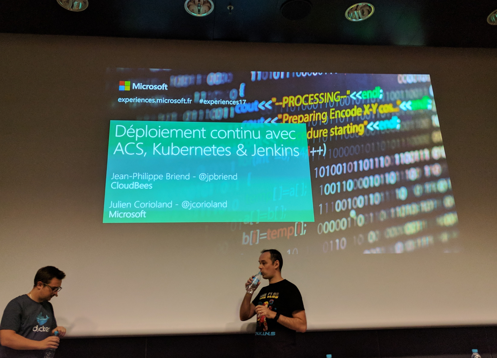

# Continuous deployment with ACS, Kubernetes and Jenkins

## Containers orchestration

Orchestrator is the interface between the infrastructure and the applications

ACS (Azure Container Service) allows to deploy an orchestrator:
- Kubernetes
- Docker Swarm
- Mesosphere

## Azure Container Servive

    az group create --name "demo" --location "westeurope"
    az acs create --name "demo-k8" -g demo - l "westeurope" --
    kubctl get nodes
    kubctl proxy
    http://127.0.0.1:8001

### Application manager for Kubernetes

Helm, package manager

Package == Helm chart

    http://kubeapps.com
    helm install --name jenkins-demo stable/jenkins

## Jenkins

## CI Pipeline
